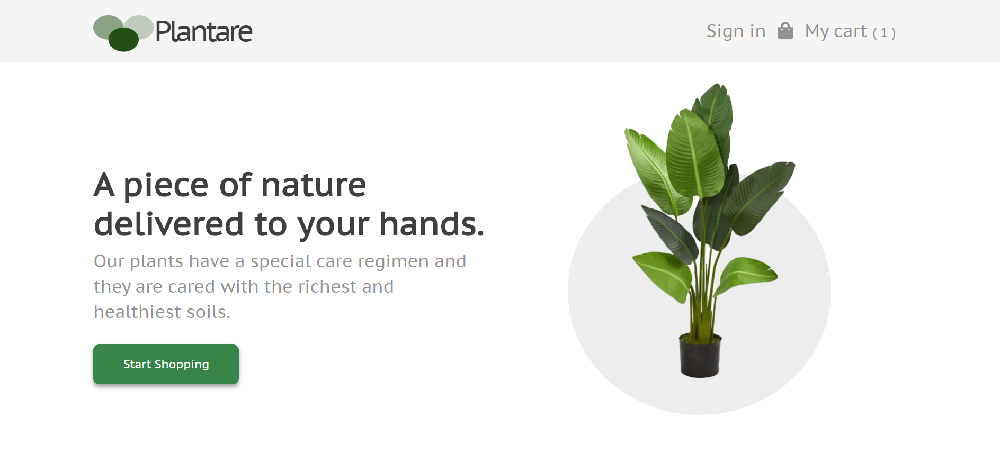

# Plantare  :herb: :herb:

### Description:

Plantare is a Full Stack Web Application built by someone that loves plants! In this faux eCommerce, I tried to mimic a real store so users can view and add items to their cart but to be able to checkout, they need to be authenticated. 
To handle checkout this project uses Stripe's API and node to handle user's requests. 

This was a solo project where I was responsible for each aspect of development including planning, design, and implementation.  
Overall I am pretty happy with the outcome as I was able to learn and implement technologies I had been very interested to work with.  

Front End : React, Context Api, Scss and Bootstrap/  
Back End : Mongo, Node and Firebase.  

---------------------------------------------

### Goals:

* Get Exposure to Jira   
* Learn and implement Unit Tests   
* Learn and Implement Stripe  

---------------------------------------------

### Achievements : 
* Fully functioning Full Stack Web Application leveraged by React, React Context, Node, and  Mongo.
* Used Firebase to handle user authentication.
* Developed following TDD patterns using Jasmine and Enzyme to shallow test components.
* Successfully integrated Stripe's API into my application to handle checkouts.
* Kept track of my tasks through Jira. 

---------------------------------------------

#### Technologies Used :  
* Figma  
* React  
* React Context  
* Sass  
* Node  
* Mongodb  
* Jira  
* Enzyme  
* Jasmine  
* Stripe  
* Firebase  

---------------------------------------------

### MVP:

-Users can sign in and out  
-Users can add and remove items to/from their carts   
-Users can see the total price of their shopping cart   

---------------------------------------------

### Link to the deployed application:

Check it out!
https://plantare.herokuapp.com/
